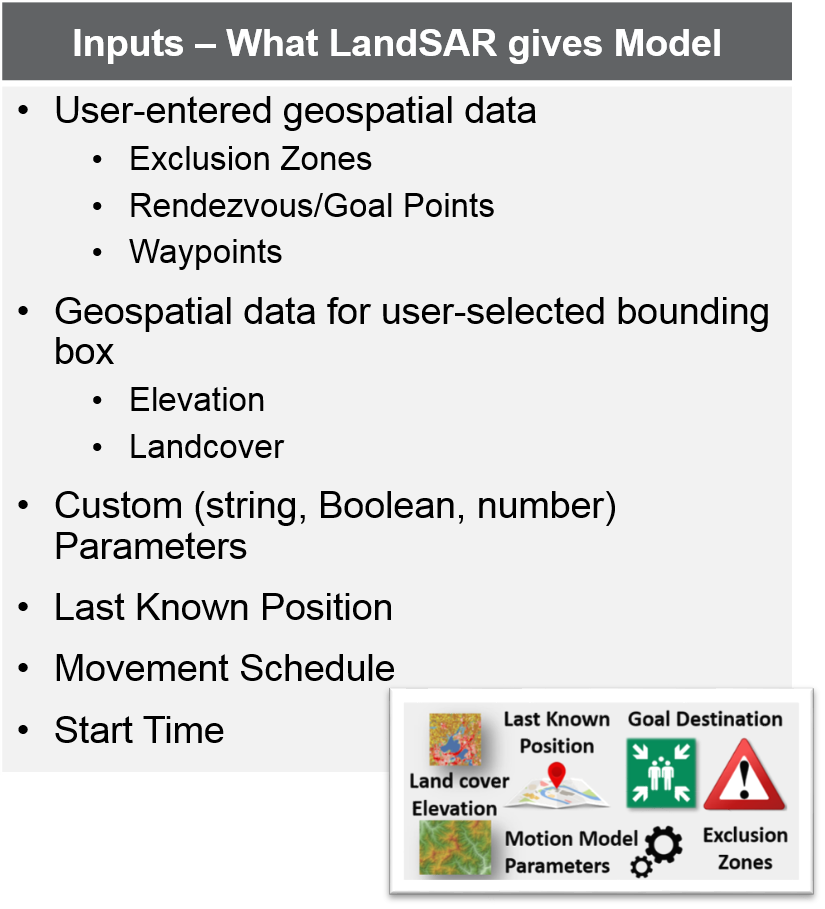
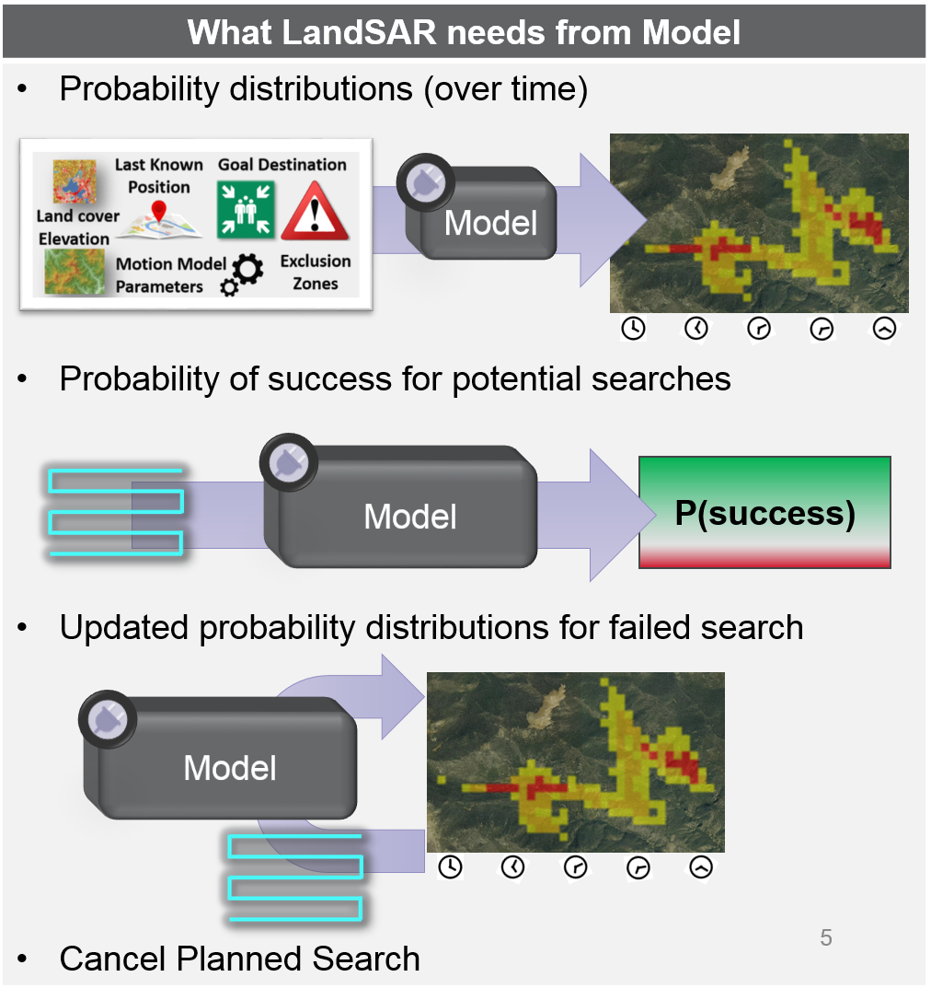
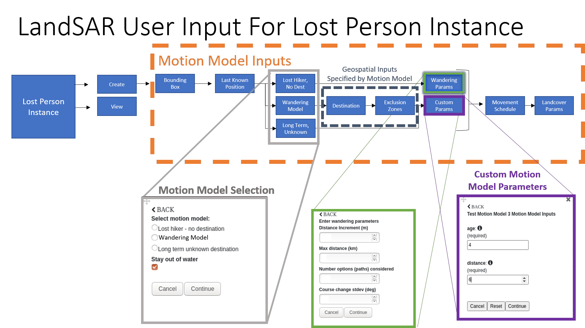
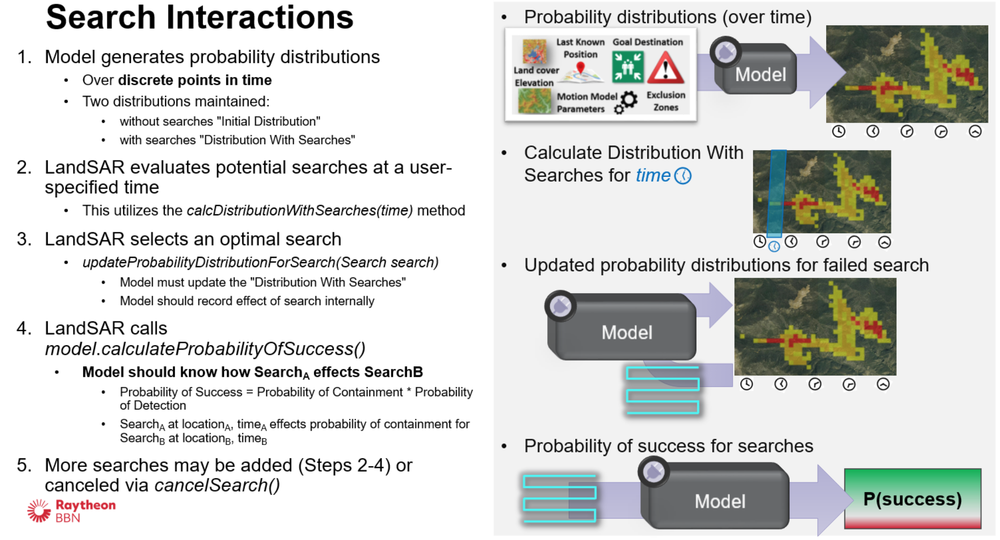

<!-- PROJECT SHIELDS -->
<!--
*** I'm using markdown "reference style" links for readability.
*** Reference links are enclosed in brackets [ ] instead of parentheses ( ).
*** See the bottom of this document for the declaration of the reference variables
*** for contributors-url, forks-url, etc. This is an optional, concise syntax you may use.
*** https://www.markdownguide.org/basic-syntax/#reference-style-links

[![Contributors][contributors-shield]][contributors-url]
[![Forks][forks-shield]][forks-url]
[![Stargazers][stars-shield]][stars-url]
[![Issues][issues-shield]][issues-url]
-->


<!-- PROJECT LOGO -->
<br />
<p align="center">
  <a href="#">
    
  </a>

  <h1 align="center">LandSAR Motion Model Software Development Kit</h1>

</p>

# Background

## LandSAR

LandSAR is a decision support tool used to assist search and rescue (SAR) personnel in locating lost persons. Users add initial inputs to LandSAR (e.g., last known location, see below for details), and the system produces a set of probability distributions, one per time period, that describe the active model's belief that the lost person is in a given location at a given point in time. Users can view these probability distributions overlaid on a map in the form of a heatmap, and drag a timeline slider to switch between the probability distributions at different times. 

LandSAR is implemented as a client/server application, with a Java-based server and several clients including browser-based and an Android Team Awareness Kit (ATAK) plugin. 

Users can then enter in information about available search assets, and the software will generate many potential searches in the bounding box, and ask the model to estimate each search's probability of finding the person (based on a calculated sweep width, probability of detection for the search asset, and the model of where the lost person is during the search time). The probability distributions are updated to reflect the search failing (if it succeeds, then the lost person is found and LandSAR isn't needed anymore), and the updated probability distributions are presented to the user, along with the recommended search area.

## LandSAR SDK

This document references a Software Development Kit (SDK) that allows 3rd parties to extend the LandSAR system with their own motion models. These models, developed as plugins to LandSAR, specify a set of required user inputs (named and typed variables that a user will be prompted to provide), and a set of logic for producing a time series of two-dimensional probability distributions that describe the likelihood of a lost person being in a given location at a given time, within a system provided geospatial bounding box. There are also methods to update probability distributions based on failed searches. The SDK provides a set Java interface that plugin developers must implement to build LandSAR plugins. Additionally, a set of commonly needed utility functions are provided, along with the Java implementations of several required data types (e.g., BoundingBox, ProbabilityDistribution). In order to employ the LandSAR plugin, the LandSAR system itself is required. The LandSAR system contains logic to download geospatial data, suggest searches, as well as additional motion models. LandSAR is not included as part of the SDK.

Summary of LandSAR Concepts
<table>
  <tr>
  <th width="250px">Concept</th><th>Description</th>
  </tr><tr>
	<td><b>Lost Person Instance (LPI)</b></td>
	<td>A set of grouped data inputs and generated data all associated with one particular model of a lost person event. One lost person event in the real world could correspond to multiple Lost Person Instances if a user models the same instance multiple times.</td>
  </tr><tr>
  	<td><b>Bounding Box</b></td><td>Two dimentional geographic area of interest for a Lost Person Instance.</td>
  </tr><tr><td><b>Motion Model</b></td><td>An algorithm that models likely locations of a lost person based on LandSAR user input</td>
  </tr><tr><td><b>Probability Distribution</b></td><td>Overlay on the bounding box, at 30m by 30m resolution cells of where a model estimates the lost person could be at a specified time</td>
  </tr><tr><td><b>ROGER</b></td><td>ROGER is a plugin framework. The LandSAR Motion Model plugins follow the ROGER framework's method of configuring, loading, and integrating plugins into the LandSAR application</td>
  </tr>
</table>

For more information about LandSAR, see <a href="https://www.google.com/url?sa=t&rct=j&q=&esrc=s&source=web&cd=&ved=2ahUKEwj6_M3CuqfyAhVvg-AKHdeTASgQFnoECAIQAQ&url=https%3A%2F%2Fwww.thinkmind.org%2Farticles%2Fgeoprocessing_2020_1_40_30050.pdf&usg=AOvVaw1Jqg5TWQEJ6jgaXDN0nXgG">A Data-Driven System for Probabilistic Lost Person Location Prediction in Geoprocessing 2020</a>. 

### Motion Model Plugins
The two figures below depict 1) what inputs LandSAR will provide to each model, and 2) what outputs LandSAR expects each model to produce.
<p align="center">
  <a href="#">
    
  </a>  <a href="#">
    
  </a>

</p>


### Motion Model User Inputs
Plugins can specify the per-LPI (Lost Person Instance) input paramaters required by their model, and the LandSAR system will automatically build a user interface appropriate for collecting inputs would the specified labels and types. The input labels and types can be specified in the MotionModelPlugin interface. 

User input control flow follows the below figure: 
<p align="center">
  <a href="#">
    
  </a>

User input control flow. The parameter set (ie. Wandering Parameters) is specific to the selected motion model (ie. Wandering Model). 
</p>

<!-- USAGE EXAMPLES -->
# SDK Usage

The main usage of the LandSAR Motion Model SDK is to write custom motion models for the LandSAR/OSPPRE decision support tool. 


## Getting started
The software development kit (SDK) is built with

* [Gradle](https://gradle.org/) for Dependency Management:
to generate the JAR file in your maven local repository run:
`./gradlew publishToMavenLocal`

To create a custom motion model plugin, import the SDK as a dependency to a Java Project: 
```gradle
implementation group: "com.bbn.landsar", name: "motion-model-sdk", version: "0.0.6"
```

## Motion Model Plugin: Estimating the Location of a Lost Person

The core functionality provided by a Motion Model Plugin is to estimate probable locations for a lost person over time. 
These estimated locations are abstracted as a <b>Initial Distribution</b>. An <b>Initial Distribution</b> is defined as: The estimated location of the lost person (over time) before considering any searches. This distribution is realized as a set of geographic distributions modeled over discrete times. 

An Initial Distribution in LandSAR follows important conventions: 
- The geographic distributions should be constrained to the provided Bounding Box. 
- The times included in any distribution should be hourly, starting at the startTime and ending when the model anticipates no further movement within the bounding box (some models use an endtime). 

In LandSAR, a motion model will determine an <b>Initial Distribution</b> once for each Lost Person Instance, and the motion model may subsequently be asked to compute updated distributions based on search areas. 

The Initial Distribution is created via the `generateInitialDistribution` method. The particular inputs are explained in further detail below.
```
public MotionModelResult generateInitialDistribution(MotionModelInput input);
```
		
### Motion Model Plugin Inputs																		
Many inputs are provided to a Motion Model Plugin so that it can determine probable locations of the lost person. In addition to Area Data, there are User-Entered Geospatial Inputs, and customizeable Motion Model Parameters. The inputs are wrapped in a Motion Model Input container object. The contents of the Motion Model Input object are listed in the table below, and discussed in more detail below the table.

#### Motion Model Input Table																
<table title="MotionModelInput Contents">
 <tr>
  <th width="250px">Input</th><th>Description</th>
  </tr><tr>
  <td><b>lpiId</b></td>
	<td>A unique identifier for this Lost Person Instance. This id is referenced when calling calculateProbabilityOfSuccess, updateProbabilityDistributionForSearch, cancelSearch, deleteModelState.</td>
</tr><tr><td><b>geospatialInputs</b></td>
	<td>User Entered Geospatial Inputs including goal/rendezvous Points, Exclusion Zones, etc. </td>
</tr><tr><td><b>areaData</b></td>
	<td>The AreaData includes the <b>Bounding Box</b> for the Lost Person Instance, as well as Elevation and LandCover data over the Bounding Box.</td>
</tr><tr><td><b>motionModelParameters</b></td>
	<td>User-entered values of parameters for this LPI. These are customizable for each plugin. Prior to calling <i>generateInitialDistribution</i>, <i>validateMotionModelParameters(Map, StatusUpdateMessage)</i> will be called with the parameters.</td>
</tr><tr><td><b>schedule</b></td>
	<td>The Movement Schedule represents when the lost person is expected to be moving. Most current movement schedules are the same for any 24-hour period, but this interface allows the Movement Schedules and types of Movement Schedules to be extended. </td>
</tr><tr><td><b>startTime</b></td>
	<td>The time (in Unix/Epoch Time) the person was last seen or estimated to be located at the startTimeDistribution. </td>
</tr><tr><td><b>startTimeDistribution</b></td>
	<td>The Last Known Point of the lost person. This may be a single point or a distribution based on user-entered data. </td>
</tr><tr><td><b>status</b></td>
	<td>The Status Update Message can be used to send information back to the LandSAR user about the progress of modeling and computation, since the <i>generateInitialDistribution</i> logic may be compute/time intensive.</td>
</table>

#### User-Entered Geospatial Inputs

LandSAR currently supports user-entered geospatial inputs of the following types: 
- Goal Points: a set of destinations an lost person may be trying to get to
- Waypoints: a set of locations a lost person might be drawn to, or stop at along the way to their end destination, for example, water sources in a desert. 
- Exclusion Zones: areas that will be avoided by a lost person. Usually, exclusion zones are implemented as circles since they are easier to find a path around, but some models may specify polygon exclusion zones. 
	- known exclusion zones are avoided at a distance, whereas unknown exclusion zones are avoided once encountered. 

All user-entered geospatial inputs are currently constrained to the confines of the Bounding Box. 

#### Motion Model Parameters
Motion Model Parameters are specified by a user for each Lost Person Instance. 

LandSAR will ask each Motion Model Plugin which parameters it needs to expose to the user: 
```
/**
 * Returns the names/descriptions of the per-Lost Person Instance parameters (required
 * or optional), that will be shown to the user for the user to input in the LandSAR User Interface. 
 */
public Set<MotionModelAttributeDescription> getMotionModelParameters();
```
Each parameter your plugin will expose to users is described by a MotionModelAttributeDescription. The MotionModelAttributeDescription enables the developer (you) to communicate with the user: 
- parameter name (also used as the key in `Map<String, Object> motionModelParameters`)
- description of the parameter 
- required or optional (optional parameters will still be shown to the user, but the user will be allowed to leave them blank)
- type (Java Class) of the parameter's value
- Unit (for example, Kilometers, seconds)

Once a new Lost Person Instance request is sent to the LandSAR Server, the user-provided values of parameters will be validated with your plugin by calling 
```
/**
 * If returning false, an Error type status update message should be sent to the user by this method. 
 * @param motionModelParameters - user-entered parameters according to {@link #getMotionModelParameters()}
 * @param status - Status Update Message that can be used to send feedback to the user
 * @return true if the parameters are a valid combination, false if any parameter
 * 		or combination of parameters is invalid
 */
public boolean validateMotionModelParameters(Map<String, Object> motionModelParameters, StatusUpdateMessage status);
```
See ['Sending Updates to the User Interface'](#sending-updates-to-the-user-interface) for more information about sending information back to a user during processing. 
	
#### Working With Area Data
The AreaData includes the Bounding Box for the Lost Person Instance, as well as Elevation and Land Cover data over the Bounding Box. AreaData will be fetched and validated prior to passing it into the Motion Model Plugin. Currently, all Area Data used by LandSAR has a 30 m resolution. 

Reading elevation values:
`double elevationMeters = areaData.getElevationData().getElevationMetersForLatLon(pt.getLatDeg(),  pt.getLonDeg());`

Using the Landcover data to adjust the speed based on the Speed of Advance Factor for the landcover type at a specific location: 
`double speed = baseSpeed * areaData.getLandcoverData().getSoaFactor(pt.getLatDeg(), pt.getLonDeg());`					

Checking if a specific location's landcover type is water: 
`areaData.getLandcoverData().isWater(pt.getLatDeg(), pt.getLonDeg());`

##### Advanced Area Data Options
To customize types of AreaData received by your plugin, you may override the `getRequiredAreaData()` method. This is implemented with default methods in `LandMotionModelPlugin` and  `MaritimeMotionModelPlugin`. Presently, either Land or Ocean data can be provided by LandSAR. To provide your own type of AreaData, implement the DataDownloader interface (this feature still in progress, contact SDK developers for more information). 

#### Sending Updates to the User Interface
The Status Update Message can be used to send information back to the LandSAR user about the progress of modeling and computation, since this method may be compute/time intensive. 

Using the available motionModelManager and provided `status` parameter to send a Status Update Message back to the UI. 
`status = motionModelManager.sendInProgressUpdate(this.name + ": halfway done computing.", status);`			
																		
### Motion Model Result

Validate Motion Model Result for SDK compliance using LandSAR validate method: 
```
MotionModelResult testMotionModelResult = testMotionModel.generateInitialDistribution(testInput);
ValidationInfo validationInfo = testMotionModelResult.validate();
assertTrue(validationInfo.errors.toString(), validationInfo.isValid());
```
Since the validate method requires that the Distribution With Searches is set upon returning the Initial Distribution, there is a convenience method to copy the Initial Distribution as the (initial) Distribution With Searches: 
`testMotionModelResult.copyInitialDistToDistWithSearches()`. 

### Putting It All Together: Estimating the Location of a Lost Person Example

```
/**
 * Create a new Model for a new Lost Person Instance and return the initial distribution (over time), 
 * mapping time to the distribution over the bounding box at that time. 
 * @param motionModelInput The MotionModelInput object is a collection of input parameters from the user as well as 
 * downloaded geospatial data and reference object(s), like the StatusUpdateMessage. It includes the following:
 *   <li>lpiId: a unique identifier for this Lost Person Instance. This id is referenced when calling 
 *      calculateProbabilityOfSuccess, updateProbabilityDistributionForSearch, cancelSearch, deleteModelState.</li>
 *   <li>geospatialInputs: geospatial inputs entered by the user, including RendezvousPoints and ExclusionZones</li>
 *   <li>areaData: geospatial data downloaded by the LandSAR Server over the <b>bounding box</b> area of interest. 
 *	The areaData object has a getter for the bounding box, as well.
 *   <li>motionModelParameters: values of parameters for this LPI. Prior to calling this method, 
 *	validateMotionModelParameters(Map, StatusUpdateMessage) will be called with the parameters.</li>
 *   <li>startTime - The time (in Unix/Epoch Time) the person was last seen or estimated to be located at the 
 *	startTimeDistribution.<li>
 *   <li>startTimeDistribution - The Last Known Point of the lost person. This may be a single point or a 
 *	distribution based on user-entered data.</li>
 *   <li>StatusUpdateMessage status - The Status Update Message can be used to send information back to the 
 *	LandSAR user about the progress of modeling and computation, since this method may be compute/time 
 	intensive.</li>
 * @return MotionModelResult containing an Initial Distribution, Distribution With Searches, LPI ID, and name of this
 * model. Both distributions should be constrained to the provided Bounding Box. The times included in any 
 * distribution should be hourly, starting at the startTime, and ending when the model anticipates no further movement
 * within the bounding box. 
 */
public MotionModelResult generateInitialDistribution(MotionModelInput motionModelInput) {
	UUID lpiId = motionModelInput.getLpiId();
	UserEnteredGeospatialData geospatialInputs = motionModelInput.getGeospatialInputs();
	AreaData areaData = motionModelInput.getAreaData();
	Map<String, Object> motionModelParameters = motionModelInput.getMotionModelParameters();
	MovementSchedule schedule = motionModelInput.getMovementSchedule();
	long startTime = motionModelInput.getStartTime();
	List<LatLonGeo> startTimeDistribution = motionModelInput.getStartTimeDistribution();
	StatusUpdateMessage status = motionModelInput.getStatus();
	
	// get general parameter(s) provided to all motion models
	Boolean stayOutOfWater = (Boolean) motionModelParameters.get(MotionModelConstants.STAY_OUT_OF_WATER);

	// Read in Model-Specific parameters (these values are set by the user when creating a new Lost Person 
	// Instance and selecting this motion model)
	// already validated direction, distance, speed in validateMotionModelParameters method
	Double direction = (Double) motionModelParameters.get(DIRECTION);
	Double speed = (Double) motionModelParameters.get(SPEED);
	Double distanceKm = (Double) motionModelParameters.get(DISTANCE);
	
	// Create an object internal to my plugin implementation to store data my motion model plugin uses. 
	// InternalModel is our example model in an example representation. This could be a ML model or set of Paths 
	// for the traditional statistical models. If you don't have paths, you need some way to track how a
	// decrease in probability over an area at one time (due to a failed search) would impact your probability 
	// distributions at future times. 
	ExampleInternalModel modelForThisLPI = new ExampleInternalModel(direction, distanceKm, speed);
	lpiData.put(lpiId, modelForThisLPI);
	
	// could change this in the future, so use a variable. It does need to evenly divide an hour, though. 
	final long timeDelta = TIME_DELTA;
	List<SampleBuilder> samplePathsInProgress = startTimeDistribution.stream().map(point ->
		new SampleBuilder(startTime, timeDelta, point, direction, distanceKm, speed))
		.collect(Collectors.toList());
	
	List<Sample> samplePaths = new ArrayList<>();
	// build up our internal model
	long time = startTime;
	while (!samplePathsInProgress.isEmpty()) {
		// All motion models should create distributions for each hour, starting from the start time  
		// "Sample" class uses 5-minute time resolution for internal model
		time += timeDelta;
		for (SampleBuilder modelBuilder : samplePathsInProgress) {
			modelBuilder.computeNextPoint(time, schedule, areaData, geospatialInputs, stayOutOfWater);
		}
		Iterator<SampleBuilder> modelIterator = samplePathsInProgress.iterator();
		while (modelIterator.hasNext()) {
			SampleBuilder modelBuilder = modelIterator.next();
			if (modelBuilder.reachedLogicalEnd(time)) {
				Sample sample = modelBuilder.build();
				samplePaths.add(sample);
				modelIterator.remove();
			}
		}			
	}
	// here, all of the sample paths have "reached a logical end"
	modelForThisLPI.setSamples(samplePaths);
	
	// create list of distributions to return
	Map<Long, ProbabilityDistribution> distributions = new HashMap<>();
	
	// add to time-based distribution (which will be shown to users as a KMZ), every hour
	for (long timeAgain = startTime; timeAgain <= modelForThisLPI.endTime(); 
		timeAgain += DateTimeUtilities.millisecInHour) {
		
		distributions.put(timeAgain, motionModelManager.createProbabilityDistribution(lpiId, timeAgain,
			areaData.getBoundingBox(), modelForThisLPI.getLocationsAtTime(timeAgain)));
	}
	// tell the user the plugin finished computing
	motionModelManager.sendInProgressUpdate(this.name + ": finished computing.", status);
	// build the result object
	MotionModelResult result = new MotionModelResult();
	result.setLpiId(motionModelInput.getLpiId());
	result.setInitialDistribution(distributions);
	result.copyInitialDistToDistWithSearches();
	// paths are optional, but if present, will be displayed in the UI
	List<Path> paths = samplePaths.stream().map(sample -> new Path(sample.getPoints()))
		.collect(Collectors.toList());
	result.setPaths(paths);
	result.setGeneratedTimestamp(System.currentTimeMillis());
	result.setGeneratingModelName(this.getName());
	return result;	
}

```
## Searches and Updating Distributions 
In addition to estimating the location of a lost person based on the initial inputs from users, motion model plugins are responsible for updating the estimated location(s) of a lost person based on failed searches. 
<p align="center">
  <a href="#">
    
  </a>

</p>

# Version
Document version: October 2024

## Change Notes

### Version 0.0.7-SNAPSHOT (October 2024)
- add support for worldcover landcover data (see https://esa-worldcover.org/en)
- add support for 3DEP elevation data (only available for United States)
  - About: https://www.usgs.gov/3d-elevation-program
  - API: https://elevation.nationalmap.gov/arcgis/rest/services/3DEPElevation/ImageServer
- allow Motion Model Plugins to use their own Geospatial Data. 
  - This (optionally) removes the requirement for LandSAR to provide Geospatial (Landcover and Elevation data) to Motion Model Plugins. 

### Version 0.0.6 (June 2023)
- Update ExamplePlugin use a string (N, S, E, W) for direction instead of a number for rotation

### Version 0.0.6-SNAPSHOT (April 2023)
- Bugfix for exclusion zones
- Remove BBN's Maritime plugin from the SDK

### Version 0.0.5 (January 2023)
- Added initial interface for writing a custom data downloader and exposing additional data types through AreaData (see `com.bbn.landsar.geospatial.DataDownloader`)
- Added abstraction, `DistOrMap`, which permits models to use a more fine grained representation than ConatinmentMap, DistributionBySamplePoints. 
- Exposed creation of probability distributions through containment map implementation 
- Add validate method on MotionModelResult. This is used by LandSAR to ensure the result meets basic system assumptions. The validate method can also be called as part of testing. 

- Added Motion Model Plugin Metadata class. This is an improvement to manage client-side data associated with Motion Model Plugins and shouldn't affect Motion Model Plugin Developers.
- Bugfix in equals method of Velocity2d
<!-- ROADMAP 
## Roadmap

See the [open issues](https://github.com/github_username/repo_name/issues) for a list of proposed features (and known issues).
-->


## License
LandSAR Motion Model Software Development Kit
Copyright (c) 2024 RTX BBN Technologies 

This program is free software: you can redistribute it and/or modify
it under the terms of the GNU General Public License as published by
the Free Software Foundation, either version 3 of the License, or
(at your option) any later version.

This program is distributed in the hope that it will be useful,
but WITHOUT ANY WARRANTY; without even the implied warranty of
MERCHANTABILITY or FITNESS FOR A PARTICULAR PURPOSE.  See the
GNU General Public License for more details.

You should have received a copy of the GNU General Public License
along with this program.  If not, see <https://www.gnu.org/licenses/>.
https://github.com/atapas/add-copyright.git


## Contact
Colleen Rock - colleen.rock@rtx.com

Nate Soule - nathaniel.soule@rtx.com


<!-- MARKDOWN LINKS & IMAGES -->
<!-- https://www.markdownguide.org/basic-syntax/#reference-style-links -->
[contributors-shield]: https://img.shields.io/github/contributors/github_username/repo.svg?style=for-the-badge
[contributors-url]: https://github.com/github_username/repo/graphs/contributors
[forks-shield]: https://img.shields.io/github/forks/github_username/repo.svg?style=for-the-badge
[forks-url]: https://github.com/github_username/repo/network/members
[stars-shield]: https://img.shields.io/github/stars/github_username/repo.svg?style=for-the-badge
[stars-url]: https://github.com/github_username/repo/stargazers
[issues-shield]: https://img.shields.io/github/issues/github_username/repo.svg?style=for-the-badge
[issues-url]: https://github.com/github_username/repo/issues
[license-shield]: https://img.shields.io/github/license/github_username/repo.svg?style=for-the-badge
[license-url]: https://github.com/github_username/repo/blob/master/LICENSE.txt
